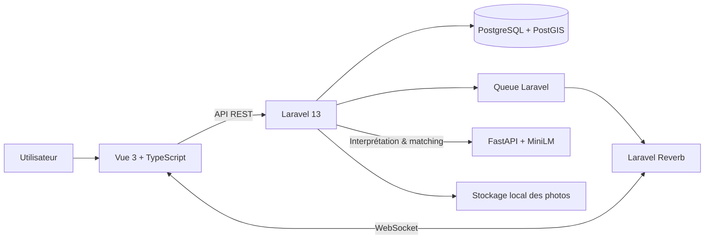

# Qribly

Qribly est une marketplace locale marocaine permettant de découvrir, publier et réserver des produits ou des services. L’application combine un catalogue national, une recherche géographique, une carte interactive, des créneaux de réservation, des favoris, des avis et une messagerie en temps réel.

> **État du projet** — développement actif sur la branche `develop`. Le projet est utilisable en local avec un jeu de démonstration complet, mais certaines fonctions décrites dans la section [Limites connues](#limites-connues) restent à finaliser avant une mise en production.

## Sommaire

- [Comprendre le produit](#comprendre-le-produit)
- [Architecture technique](#architecture-technique)
- [Démarrage rapide avec Docker](#démarrage-rapide-avec-docker)
- [Données et comptes de démonstration](#données-et-comptes-de-démonstration)
- [Guide détaillé des scénarios de test](#guide-détaillé-des-scénarios-de-test)
- [Tests automatisés et qualité](#tests-automatisés-et-qualité)
- [Installation manuelle](#installation-manuelle)
- [API et structure du dépôt](#api-et-structure-du-dépôt)
- [Workflow de contribution](#workflow-de-contribution)
- [Dépannage](#dépannage)
- [Limites connues](#limites-connues)

## Comprendre le produit

### Problème traité

Qribly facilite les échanges de proximité au Maroc. Un utilisateur peut rechercher une annonce partout au Maroc, dans une ville précise ou autour de sa position, puis contacter le propriétaire ou réserver un créneau lorsqu’il s’agit d’un service.

### Profils fonctionnels

Qribly ne sépare pas techniquement les utilisateurs en rôles permanents. Un même compte peut agir comme client ou comme prestataire selon le contexte.

| Profil fonctionnel | Actions principales                                                                                                             |
| ------------------ | ------------------------------------------------------------------------------------------------------------------------------- |
| Visiteur           | Parcourir les annonces, rechercher, filtrer, consulter une offre et ses avis                                                    |
| Client             | Ajouter aux favoris, contacter un prestataire, réserver un service, décrire un besoin en langage naturel, comparer et accepter une proposition, annuler sa réservation et laisser un avis après réalisation |
| Prestataire        | Publier une annonce, définir ses disponibilités, consulter les demandes compatibles avec ses annonces et y répondre, confirmer ou annuler une demande et terminer une prestation réalisée |

### Concepts importants

- une **annonce** est un produit ou un service publié par un utilisateur ;
- un **produit** peut être actif, réservé, vendu ou inactif ;
- un **service** possède une durée et peut proposer des créneaux selon les disponibilités du prestataire ;
- une **réservation** bloque toute plage qui chevauche sa durée, pas uniquement son heure de début ;
- les heures de réservation sont présentées selon l’heure du Maroc ;
- la distance est calculée avec PostGIS à partir des coordonnées géographiques de l’annonce ;
- une **demande de service** est un besoin décrit en langage naturel par un client, interprété automatiquement (catégorie, ville, période, budget, lieu) puis comparé aux annonces de service actives ;
- une demande reste **ouverte** un maximum de sept jours ou jusqu’à la fin de la période souhaitée, selon la première échéance atteinte ;
- le **matching** combine un filtre structurel (catégorie, ville, lieu de prestation à domicile ou chez le prestataire) et un score de similarité sémantique calculé par le service IA ; seules les annonces au-dessus du seuil configuré (`AI_SERVICE_REQUEST_MATCH_THRESHOLD`, `0.42` par défaut) sont retenues, une seule par prestataire ;
- ce matching est recalculé automatiquement à la création d’une annonce, et à sa modification si la catégorie, le titre, la description, le type, le statut, la ville ou le lieu de prestation changent — modifier uniquement le prix ne redéclenche pas le calcul ;
- une **proposition** de prestataire est associée à une seule annonce compatible à la fois ; un prestataire ne peut avoir qu’une proposition active par demande (un nouvel envoi remplace l’ancienne tant qu’elle est en attente).

### Cycle de vie d’une réservation

```text
Demande créée (pending)
    ├── confirmée par le prestataire (confirmed)
    │       ├── terminée après la fin du rendez-vous (completed)
    │       └── annulée (cancelled)
    └── annulée (cancelled)

completed → le client peut laisser un avis
```

Une réservation confirmée ne peut pas être terminée avant `heure de début + durée`. Cette règle est appliquée dans l’interface et contrôlée de nouveau par l’API.

### Cycle de vie d’une demande de service et d’une proposition

```text
Demande publiée (open)
    ├── proposition reçue (pending)
    │       ├── acceptée par le client (accepted) → réservation créée + demande → fulfilled
    │       │                                         (les autres propositions pending → declined)
    │       ├── refusée par le client (declined)
    │       └── retirée par le prestataire (withdrawn) → il peut proposer à nouveau
    └── annulée par le client (cancelled) → toutes les propositions pending → declined

Passé le délai (desired_end_at, ou 7 jours maximum), une demande n’accepte plus de nouvelle proposition
même si son statut reste techniquement « open » en base.
```

Aucune donnée de démonstration n’est seedée pour les demandes et les propositions : elles doivent être créées manuellement en suivant le scénario **S-15** du guide de test avant de tester la suite du parcours.

### Fonctionnalités disponibles

- inscription, connexion et authentification API avec Laravel Sanctum ;
- création et modification d’annonces produit ou service ;
- ajout de cinq photos maximum aux formats JPG, PNG, WEBP ou AVIF ;
- sélection recherchable d’une ville et positionnement précis sur une carte ;
- consultation des annonces partout au Maroc ;
- recherche dans une ville, autour d’une ville ou autour de la position actuelle ;
- filtres par catégorie, type, statut et prix ;
- vues liste, liste avec carte et carte immersive ;
- classement sémantique optionnel des résultats de recherche textuelle avec un service Python ;
- description d’un besoin en langage naturel, interprété automatiquement par IA (catégorie, ville, période, budget, lieu), avec des clarifications ciblées quand une information manque ;
- matching sémantique automatique entre une demande et les annonces de service compatibles, recalculé à la création ou à la modification pertinente d’une annonce ;
- propositions prestataire (prix, créneau, message), avec envoi, modification et retrait ;
- acceptation d’une proposition par le client : création immédiate d’une réservation et refus automatique des propositions concurrentes ;
- disponibilités hebdomadaires des prestataires, gérées dans un onglet dédié du profil ;
- réservation avec gestion de la durée et des conflits ;
- favoris, avis et notifications ;
- conversations et messages en temps réel avec Laravel Reverb, y compris une conversation dédiée à chaque proposition, avec rappel du contexte (offre, prix, créneau) ;
- modification du profil (nom, e-mail) ;
- page d’accueil enrichie : bandeau vedette, carrousel d’annonces et vitrine illustrée des catégories ;
- données de démonstration françaises avec photos locales.

## Architecture technique



| Couche               | Technologies principales                                                       | Responsabilité                                                |
| -------------------- | ------------------------------------------------------------------------------ | ------------------------------------------------------------- |
| Frontend             | Vue 3, TypeScript, Vite, Tailwind CSS, Pinia, Vue Router, Headless UI, Leaflet | Interface, navigation, cartes et état client                  |
| Backend              | PHP 8.4, Laravel 13, Sanctum, Reverb                                           | API, autorisations, réservations, notifications et temps réel |
| Données              | PostgreSQL 16, PostGIS                                                         | Données relationnelles, coordonnées et calcul des distances   |
| Service IA            | FastAPI, Sentence Transformers, MiniLM multilingue, Groq/OpenAI en option       | Interprétation des demandes de service et classement sémantique des annonces |
| Infrastructure       | Docker Compose, Nginx en production                                            | Environnement local et préparation du déploiement             |
| Qualité              | PHPUnit, Laravel Pint, Vue TSC, Vite, GitHub Actions                           | Tests, formatage, compilation et intégration continue         |

## Démarrage rapide avec Docker

Docker est la méthode recommandée pour les membres de l’équipe comme pour les contributeurs externes.

### Prérequis

- Git ;
- Docker Desktop avec Docker Compose ;
- ports `5173`, `8000`, `8001`, `8080` et `5432` disponibles.

### Installation

```bash
git clone https://github.com/anass-elouali/qribly.git
cd qribly
git switch develop
docker compose up --build -d
```

Le premier démarrage peut prendre plusieurs minutes. Le backend installe Composer, crée son fichier `.env`, génère la clé Laravel, exécute les migrations et charge les seeders. Le service IA télécharge son modèle lors de sa première utilisation.

Créer ensuite le lien public utilisé par les photos :

```bash
docker compose exec backend php artisan storage:link
```

### Vérifier l’installation

```bash
docker compose ps
docker compose logs --tail=50 backend
```

Les conteneurs `postgres` et `backend` doivent être sains. Les autres services doivent être démarrés sans boucle d’erreur.

| Service            | Adresse locale                         | Vérification rapide                      |
| ------------------ | -------------------------------------- | ---------------------------------------- |
| Application Vue    | <http://localhost:5173>                | La page d’accueil s’affiche              |
| API Laravel        | <http://localhost:8000/api/categories> | Une réponse JSON est retournée           |
| Laravel Reverb     | `ws://localhost:8080`                  | Les messages arrivent sans actualisation |
| Service IA         | <http://localhost:8001/health>         | Le service FastAPI retourne `status: ok` |
| PostgreSQL/PostGIS | `localhost:5432`                       | Le conteneur est marqué sain             |

### Commandes courantes

```bash
# Démarrer ou reconstruire l’environnement
docker compose up --build -d

# Suivre les journaux
docker compose logs -f backend frontend queue reverb

# Arrêter les services sans supprimer la base
docker compose down

# Redémarrer un service
docker compose restart backend
```

## Données et comptes de démonstration

### Réinitialiser l’environnement de test

Pour repartir du même état avant une campagne de test :

```bash
docker compose exec backend php artisan migrate:fresh --seed --force
docker compose exec backend php artisan storage:link
```

> **Attention :** `migrate:fresh` supprime définitivement toutes les données de la base locale `qribly`. Ne jamais exécuter cette commande sur une base partagée ou de production.

Après une réinitialisation, les anciens jetons d’authentification ne sont plus valides. Se déconnecter puis se reconnecter dans le navigateur.

Le jeu de démonstration contient :

- 7 utilisateurs ;
- 8 catégories ;
- 12 annonces et 60 photos locales ;
- 26 disponibilités hebdomadaires ;
- 11 réservations couvrant tous les statuts ;
- 5 avis, 8 favoris, 3 conversations et 10 messages ;
- 6 notifications.

Les dates de réservation sont calculées relativement au jour d’exécution du seeder. Il faut identifier les scénarios par le titre de l’offre et le statut, pas par une date fixe ou un identifiant numérique.

### Comptes de test

Tous les comptes utilisent le mot de passe `password`.

| Nom               | E-mail                    | Données utiles pour les tests                                        |
| ----------------- | ------------------------- | -------------------------------------------------------------------- |
| Nadia El Mansouri | `prestataire@qribly.test` | Prestataire principal, 3 services, demandes en attente et confirmées |
| Mehdi Berrada     | `client@qribly.test`      | Client principal, réservations, favoris, messages et notifications   |
| Lina Tahiri       | `lina@qribly.test`        | Second client, réservations réparties chez plusieurs prestataires    |
| Youssef Amrani    | `youssef@qribly.test`     | Services de transport à Marrakech et Ourika                          |
| Sara Benali       | `sara@qribly.test`        | Service et produit électronique à Casablanca                         |
| Omar Alaoui       | `omar@qribly.test`        | Cours de mathématiques à Rabat                                       |
| Salma Idrissi     | `salma@qribly.test`       | Coiffure, caftan et pâtisseries                                      |

Ces identifiants sont exclusivement réservés au développement et à la démonstration.

### Catalogue seedé

| Annonce                                    | Propriétaire | Type    | Ville      | Statut  | Durée  |
| ------------------------------------------ | ------------ | ------- | ---------- | ------- | ------ |
| Grand ménage d’un appartement              | Nadia        | Service | Marrakech  | Actif   | 2 h    |
| Entretien et nettoyage de climatisation    | Nadia        | Service | Marrakech  | Actif   | 1 h 30 |
| Chef à domicile — menu marocain            | Nadia        | Service | Agadir     | Actif   | 3 h    |
| Réparation de smartphone                   | Sara         | Service | Casablanca | Actif   | 1 h    |
| PC portable reconditionné                  | Sara         | Produit | Casablanca | Réservé | —      |
| Cours de soutien en mathématiques          | Omar         | Service | Rabat      | Actif   | 1 h 30 |
| Coiffure et brushing à domicile            | Salma        | Service | Rabat      | Actif   | 1 h    |
| Livraison express de petits colis          | Youssef      | Service | Marrakech  | Actif   | 1 h    |
| Location de VTT dans la vallée de l’Ourika | Youssef      | Service | Ourika     | Actif   | 4 h    |
| Panier de légumes bio de saison            | Youssef      | Produit | Marrakech  | Actif   | —      |
| Caftan marocain brodé à la main            | Salma        | Produit | Tanger     | Vendu   | —      |
| Assortiment de pâtisseries marocaines      | Salma        | Produit | Essaouira  | Inactif | —      |

### Réservations seedées

| Client | Offre                         | Prestataire | Statut                     | Créneau relatif                         |
| ------ | ----------------------------- | ----------- | -------------------------- | --------------------------------------- |
| Mehdi  | Grand ménage d’un appartement | Nadia       | En attente                 | Prochain lundi à 09:00                  |
| Lina   | Réparation de smartphone      | Sara        | En attente                 | Prochain mardi à 10:00                  |
| Mehdi  | Entretien de climatisation    | Nadia       | Confirmée                  | Prochain mercredi à 13:00               |
| Lina   | Location de VTT               | Youssef     | Confirmée                  | Prochain vendredi à 09:00               |
| Mehdi  | Cours de mathématiques        | Omar        | Terminée                   | Mercredi précédent à 15:00              |
| Lina   | Coiffure et brushing          | Salma       | Terminée                   | Samedi précédent à 11:00                |
| Lina   | Grand ménage d’un appartement | Nadia       | Terminée                   | Lundi d’une semaine précédente à 13:00  |
| Mehdi  | Livraison de petits colis     | Youssef     | Terminée                   | Jeudi précédent à 10:00                 |
| Lina   | Chef à domicile               | Nadia       | Terminée                   | Samedi d’une semaine précédente à 12:00 |
| Mehdi  | Livraison de petits colis     | Youssef     | Annulée par le client      | Prochain jeudi à 14:00                  |
| Lina   | Chef à domicile               | Nadia       | Annulée par le prestataire | Prochain samedi à 12:00                 |

## Guide détaillé des scénarios de test

### Règles de campagne

1. Réinitialiser la base avant une campagne complète.
2. Noter le navigateur, la taille d’écran et le commit testé.
3. Ne pas utiliser les identifiants numériques des annonces ou réservations comme référence stable.
4. Utiliser deux fenêtres ou une fenêtre privée lorsqu’un scénario implique un client et un prestataire.
5. Après un scénario qui modifie les données, continuer avec l’état obtenu ou réinitialiser la base avant un scénario indépendant.
6. Les scénarios S-15 et suivants portent sur les demandes de service : comme aucune demande ni proposition n’est seedée, les créer en suivant l’ordre indiqué, chaque scénario réutilisant les données du précédent sauf mention contraire.

Modèle de résultat conseillé :

| Champ               | Valeur                                     |
| ------------------- | ------------------------------------------ |
| Scénario            | `S-XX — Nom du scénario`                   |
| Commit              | Résultat de `git rev-parse --short HEAD`   |
| Environnement       | Docker local / autre                       |
| Navigateur et écran | Exemple : Chrome, 1440 × 900               |
| Résultat            | Réussi / Échoué / Bloqué                   |
| Preuve              | Capture, réponse API ou message d’erreur   |
| Remarque            | Étapes exactes pour reproduire un problème |

### S-00 — Démarrage et santé des services

**Objectif :** vérifier que l’environnement est prêt avant les tests fonctionnels.

**Prérequis :** dépôt cloné et Docker Desktop démarré.

**Étapes :**

1. Exécuter `docker compose up --build -d`.
2. Exécuter `docker compose ps`.
3. Ouvrir <http://localhost:8000/api/categories>.
4. Ouvrir <http://localhost:5173>.
5. Vérifier qu’au moins une carte d’annonce contient une photo, une ville et un prix.

**Résultat attendu :** l’API retourne les catégories, l’application s’affiche sans erreur bloquante et les photos sont chargées.

### S-01 — Découverte publique et filtres

**Objectif :** vérifier le catalogue sans authentification.

**Prérequis :** être déconnecté.

**Étapes :**

1. Ouvrir la page **Près de moi**.
2. Vérifier que le mode initial est **Partout au Maroc**.
3. Rechercher `mathématiques`.
4. Vérifier que l’offre **Cours de soutien en mathématiques** apparaît.
5. Effacer la recherche puis ouvrir **Filtres**.
6. Choisir `Services`, la catégorie `Éducation`, puis appliquer.
7. Retirer les filtres.

**Résultat attendu :** les résultats et leur compteur se mettent à jour, les filtres actifs restent visibles et leur suppression restaure le catalogue.

### S-02 — Recherche par ville, alentours et distance

**Objectif :** vérifier la logique géographique et la carte.

**Étapes :**

1. Dans **Près de moi**, sélectionner la recherche par ville.
2. Rechercher puis choisir `Rabat` dans la liste recherchable.
3. Choisir **Dans Rabat** et vérifier que les offres de mathématiques et de coiffure apparaissent.
4. Choisir **Rabat et alentours**.
5. Tester successivement plusieurs rayons parmi `5`, `10`, `25`, `50` et `100 km`.
6. Vérifier que chaque carte affiche une distance et que la carte se recentre sur la zone choisie.
7. Passer entre les modes **Distances**, **Liste + carte** et **Carte** lorsqu’ils sont disponibles.

**Résultat attendu :** le sélecteur de ville reste cohérent avec le mode choisi, les annonces respectent le rayon et les distances correspondent aux marqueurs de la carte.

**Variante géolocalisation :** choisir **Ma position**, autoriser la géolocalisation et vérifier que le filtre de ville disparaît. En cas de refus de permission, un message explicite doit être affiché sans casser le catalogue.

### S-03 — Authentification et protection des pages privées

**Objectif :** vérifier la session et les redirections.

**Étapes :**

1. Déconnecté, ouvrir directement `/profile` puis `/messages`.
2. Vérifier la redirection vers la connexion.
3. Se connecter avec `client@qribly.test` / `password`.
4. Vérifier le retour à une navigation authentifiée et l’accès au profil.
5. Se déconnecter.
6. Tenter une connexion avec un mot de passe incorrect.

**Résultat attendu :** les pages privées sont protégées, la bonne connexion réussit, la déconnexion invalide la session et l’échec de connexion affiche un message compréhensible.

### S-04 — Détail d’un produit et détail d’un service

**Objectif :** vérifier que l’interface distingue correctement les deux types d’annonces.

**Étapes :**

1. Ouvrir **PC portable reconditionné**.
2. Vérifier la galerie, le statut réservé, la ville, le vendeur, la description, le prix et la carte.
3. Vérifier qu’aucun sélecteur de créneau n’est proposé pour ce produit.
4. Ouvrir **Cours de soutien en mathématiques**.
5. Vérifier la galerie, la durée `1 h 30`, les disponibilités, les avis, le prestataire et la localisation.

**Résultat attendu :** les informations communes sont cohérentes et seul le service présente le parcours de réservation.

### S-05 — Favoris

**Objectif :** vérifier l’ajout et la suppression d’un favori.

**Prérequis :** être connecté avec `client@qribly.test`.

**Étapes :**

1. Ouvrir une annonce qui n’est pas déjà dans les favoris.
2. Cliquer sur le bouton favori.
3. Ouvrir **Profil → Mes favoris**.
4. Vérifier que l’annonce est présente.
5. Retirer le favori et actualiser la page.

**Résultat attendu :** l’état du bouton et la liste du profil restent synchronisés après actualisation.

### S-06 — Publication d’une annonce

**Objectif :** vérifier le formulaire en trois étapes.

**Prérequis :** être connecté avec un compte de démonstration.

**Étapes :**

1. Cliquer sur **Publier une annonce**.
2. Créer une annonce de test avec un titre facilement identifiable, par exemple `TEST QA — Nettoyage canapé`.
3. Compléter le type, la catégorie, la description, le prix et la durée si le type est `Service`.
4. Ajouter une à cinq images valides.
5. Vérifier l’aperçu et la suppression des images.
6. Rechercher une ville dans la liste puis placer le marqueur sur la carte.
7. Publier l’annonce.

**Résultat attendu :** chaque étape conserve ses données, les erreurs sont affichées près des champs concernés et l’annonce publiée possède ses photos, sa ville et son emplacement.

**Nettoyage :** supprimer l’annonce depuis **Mes annonces** ou réinitialiser la base.

### S-07 — Création d’une réservation et chevauchement des créneaux

**Objectif :** vérifier la durée réelle d’une prestation et le blocage des créneaux qui se chevauchent.

**Prérequis :** être connecté avec `client@qribly.test` et choisir un service qui ne lui appartient pas.

**Étapes :**

1. Ouvrir **Cours de soutien en mathématiques**, durée `1 h 30`.
2. Choisir un jour disponible et noter tous les créneaux affichés autour de l’heure choisie.
3. Sélectionner un créneau, saisir une note puis confirmer la demande.
4. Ouvrir **Profil → Mes réservations** et vérifier le statut **En attente**.
5. Revenir sur l’offre et le même jour.

**Résultat attendu :** la réservation apparaît avec sa date, son heure et sa durée. Tous les départs qui chevaucheraient la plage réservée disparaissent. Par exemple, une réservation `18:30–20:00` rend indisponible un départ à `18:00` si celui-ci durerait jusqu’à `19:30`.

### S-08 — Confirmation d’une demande par le prestataire

**Objectif :** vérifier le passage de `pending` à `confirmed`.

**Prérequis :** base seedée.

**Étapes prestataire :**

1. Se connecter avec `prestataire@qribly.test`.
2. Ouvrir **Profil → Réservations reçues**.
3. Filtrer sur **En attente**.
4. Ouvrir la demande **Grand ménage d’un appartement** de Mehdi.
5. Cliquer sur **Confirmer** puis valider la fenêtre de confirmation.

**Étapes client :**

6. Se connecter avec `client@qribly.test` dans une autre fenêtre.
7. Ouvrir **Mes réservations** et les notifications.

**Résultat attendu :** le prestataire voit le statut **Confirmée**, le client voit le même statut et reçoit une notification. Le créneau reste indisponible.

### S-09 — Protection contre une fin de service anticipée

**Objectif :** vérifier la règle métier empêchant de terminer une prestation trop tôt.

**Prérequis :** base seedée et compte `prestataire@qribly.test`.

**Étapes :**

1. Ouvrir **Réservations reçues → Confirmées**.
2. Repérer **Entretien et nettoyage de climatisation**.
3. Vérifier le rendez-vous et sa durée `1 h 30`.
4. Observer le bouton **Marquer comme terminée** sur la carte.
5. Ouvrir **Voir les détails** et observer le bouton **Terminer**.

**Résultat attendu :** les deux boutons sont désactivés avant la fin du rendez-vous. Un message indique l’heure exacte à partir de laquelle l’action sera disponible.

**Test automatisé associé :**

```bash
docker compose exec backend php artisan test --filter=provider_cannot_complete_a_reservation_before_the_appointment_ends
```

### S-10 — Annulation et libération du créneau

**Objectif :** vérifier qu’une annulation libère la plage réservée.

**Prérequis :** créer une nouvelle réservation en attente et noter précisément son offre, sa date et son heure.

**Étapes :**

1. Avec le client, ouvrir **Mes réservations**.
2. Annuler la réservation test et confirmer la fenêtre.
3. Vérifier le statut **Annulée**.
4. Revenir sur l’offre et le jour initialement choisi.

**Résultat attendu :** la réservation est annulée, le prestataire ne peut plus la confirmer et le créneau redevient réservable.

### S-11 — Messagerie en temps réel

**Objectif :** vérifier la conversation, Reverb et la lecture des messages.

**Prérequis :** ouvrir deux fenêtres : Mehdi dans la première, Nadia dans la seconde.

**Étapes :**

1. Avec Mehdi, ouvrir la conversation existante avec Nadia.
2. Envoyer un message identifiable, par exemple `TEST TEMPS RÉEL — Bonjour`.
3. Observer la fenêtre de Nadia sans l’actualiser.
4. Répondre depuis Nadia.
5. Revenir à la fenêtre de Mehdi sans actualiser.

**Résultat attendu :** les deux messages apparaissent dans l’ordre, sans rechargement, et l’état de lecture se met à jour.

Si le test échoue :

```bash
docker compose logs --tail=100 backend queue reverb
```

### S-12 — Réservations terminées et avis

**Objectif :** vérifier l’affichage des prestations terminées et des avis existants.

**Étapes :**

1. Se connecter avec `client@qribly.test`.
2. Ouvrir **Mes réservations** et repérer **Cours de soutien en mathématiques** terminé.
3. Ouvrir l’offre correspondante.
4. Vérifier que l’avis seedé est affiché avec sa note et son commentaire.
5. Répéter avec un autre compte ou une autre offre terminée.

**Résultat attendu :** seuls les clients d’une réservation terminée peuvent être auteurs d’un avis et chaque avis apparaît sur l’offre concernée.

> **Couverture actuelle :** les cinq réservations terminées seedées possèdent déjà un avis. Le jeu de démonstration ne fournit pas encore de réservation terminée sans avis pour tester directement le formulaire de création. Ce cas doit être ajouté aux seeders avant de considérer la validation manuelle des avis comme complète.

### S-13 — Autorisations entre utilisateurs

**Objectif :** vérifier qu’un utilisateur ne peut pas administrer les données d’un autre.

**Étapes :**

1. Se connecter avec `sara@qribly.test`.
2. Ouvrir une annonce appartenant à Nadia.
3. Vérifier que les actions de modification et suppression ne sont pas proposées.
4. Ouvrir **Réservations reçues** et vérifier que seules les réservations des offres de Sara sont affichées.
5. Vérifier avec les tests API qu’une réservation reçue par un autre prestataire ne peut pas être confirmée.

**Résultat attendu :** l’interface masque les actions non autorisées et l’API retourne `403` si une requête est forcée.

### S-14 — Vérification responsive et accessibilité minimale

**Objectif :** détecter les régressions évidentes sur les écrans principaux.

**Tailles minimales à tester :** `375 × 812`, `768 × 1024` et `1440 × 900`.

**Pages :** accueil, Près de moi, détail d’offre, publication, profil, réservations et messagerie.

**Vérifications :**

- aucun défilement horizontal involontaire ;
- photos non déformées ;
- actions principales visibles et cliquables ;
- navigation réalisable au clavier ;
- focus visible sur les boutons et champs ;
- fenêtres fermables avec `Échap` et focus conservé à l’intérieur ;
- libellés compréhensibles sans dépendre uniquement de la couleur ;
- messages d’erreur associés à l’action concernée.

### S-15 — Création d’une demande de service intelligente (assistant IA)

**Objectif :** vérifier l’assistant qui interprète un besoin en langage naturel et guide le client jusqu’à la publication.

**Prérequis :** connecté avec `client@qribly.test`.

**Étapes :**

1. Ouvrir **Demander à Qrib**.
2. À l’étape **Besoin**, saisir un texte proche du catalogue seedé, par exemple : *« Je cherche quelqu’un pour un grand ménage de mon appartement à Marrakech, chez moi, la semaine prochaine, budget 300 DH. »*
3. Cliquer sur **Analyser ma demande**.
4. À l’étape **Précisions**, vérifier que seuls les champs que l’IA n’a pas pu déduire sont proposés (deux au maximum à la fois) ; les compléter si nécessaire puis **Continuer**.
5. À l’étape **Validation**, vérifier le résumé modifiable et le récapitulatif (service, ville, disponibilité, budget maximum, déplacement), puis **Publier ma demande**.
6. À l’étape **Publiée**, noter le numéro affiché (« Ta demande n°… est ouverte. ») et cliquer sur **Suivre ma demande n°…**.

**Résultat attendu :** la demande est créée avec le statut **Ouverte**, la catégorie **Services à domicile** et la ville **Marrakech** sont correctement déduites du texte, et la page de suivi affiche le résumé.

**Variante — mode manuel :** arrêter temporairement le service IA (`docker compose stop ai-service`) puis répéter les étapes 2 et 3. L’assistant doit basculer automatiquement en mode manuel avec tous les champs requis affichés, sans bloquer la publication. Redémarrer ensuite avec `docker compose start ai-service`.

**Test automatisé associé :**

```bash
docker compose exec backend php artisan test --filter=test_customer_can_publish_a_request_and_compatible_providers_are_notified
```

### S-16 — Prestataire : demande compatible et envoi d’une proposition

**Objectif :** vérifier que le matching structurel et sémantique expose la demande au bon prestataire, et que la proposition respecte le budget et la période demandés.

**Prérequis :** demande créée au scénario S-15. Se connecter avec `prestataire@qribly.test` dans une seconde fenêtre.

**Étapes :**

1. Ouvrir **Profil → Demandes compatibles**.
2. Vérifier que la demande de S-15 apparaît avec le résumé, le nom du client et les tuiles Ville, Période souhaitée, Budget et Lieu du service.
3. Vérifier que le bloc **Annonce utilisée** affiche bien **Grand ménage d’un appartement**.
4. Cliquer sur **Faire une proposition**.
5. Saisir un prix inférieur ou égal au budget maximum, choisir un créneau dans la fenêtre proposée par le client, ajouter un message, puis **Envoyer la proposition**.
6. Répéter avec un prix supérieur au budget, puis avec un créneau hors de la période souhaitée.

**Résultat attendu :** la proposition valide apparaît avec le statut **Proposition envoyée** ; les deux tentatives invalides (prix ou créneau) sont refusées avec un message explicite avant l’envoi.

**Test automatisé associé :**

```bash
docker compose exec backend php artisan test --filter=test_proposal_must_respect_budget_and_requested_period
```

### S-17 — Modification et retrait d’une proposition

**Objectif :** vérifier qu’une proposition en attente peut être modifiée (une seule proposition active par couple demande/prestataire) ou retirée, puis renvoyée.

**Prérequis :** proposition envoyée au scénario S-16, toujours connecté avec `prestataire@qribly.test`.

**Étapes :**

1. Dans **Demandes compatibles**, ouvrir la proposition envoyée et cliquer sur **Modifier**.
2. Changer le prix ou le créneau puis renvoyer.
3. Vérifier que le statut reste **Proposition envoyée** après la modification.
4. Cliquer sur **Retirer**.
5. Vérifier le statut **Proposition retirée**, puis soumettre une nouvelle proposition sur la même demande.

**Résultat attendu :** la modification met à jour la proposition existante sans en créer une seconde, et le retrait permet un nouvel envoi.

**Test automatisé associé :**

```bash
docker compose exec backend php artisan test --filter=test_provider_can_withdraw_and_resubmit_a_proposal
```

### S-18 — Discuter d’une proposition (conversation liée)

**Objectif :** vérifier la conversation dédiée à une proposition et le contexte affiché dans la messagerie.

**Prérequis :** proposition en attente sur la demande de S-15/S-16. Deux fenêtres : Mehdi (client) et Nadia (prestataire).

**Étapes :**

1. Avec Mehdi, ouvrir la page de suivi de la demande puis cliquer sur **Discuter** sur la proposition de Nadia.
2. Vérifier la redirection vers la messagerie et la carte de contexte en haut du fil (offre, prix proposé, rendez-vous proposé, résumé de la demande, message du prestataire).
3. Envoyer un message identifiable.
4. Avec Nadia, ouvrir la même conversation depuis la liste et vérifier que son aperçu affiche `Proposition · Grand ménage d’un appartement` et le même contexte.

**Résultat attendu :** une seule conversation existe pour ce couple client/prestataire/proposition, distincte d’une éventuelle conversation générale entre les deux mêmes utilisateurs.

**Test automatisé associé :**

```bash
docker compose exec backend php artisan test --filter=test_customer_and_provider_share_a_private_conversation_with_proposal_context
```

### S-19 — Acceptation d’une proposition

**Objectif :** vérifier la création de la réservation et le refus automatique des propositions concurrentes.

**Prérequis :** au moins deux propositions en attente sur la même demande. Si nécessaire, faire proposer un second compte prestataire disposant d’une annonce compatible.

**Étapes :**

1. Avec le client, ouvrir la page de suivi de la demande.
2. Cliquer sur **Accepter** sur une des propositions et confirmer la fenêtre de confirmation du navigateur.
3. Vérifier le statut **Finalisée** de la demande et **Acceptée** de la proposition choisie.
4. Vérifier que toute autre proposition en attente passe automatiquement à **Refusée**.
5. Se connecter avec le prestataire retenu et vérifier l’apparition de la réservation en statut **En attente** dans **Réservations reçues**.

**Résultat attendu :** une réservation est créée avec le prix et le créneau de la proposition acceptée, la demande devient **Finalisée** et ne propose plus les actions Accepter/Refuser/Discuter.

**Test automatisé associé :**

```bash
docker compose exec backend php artisan test --filter=test_customer_can_accept_a_proposal_and_create_a_reservation
```

### S-20 — Refus d’une proposition et annulation d’une demande

**Objectif :** vérifier le refus manuel d’une proposition et l’annulation d’une demande encore ouverte.

**Prérequis :** publier une nouvelle demande (répéter S-15 avec un texte différent) avec au moins une proposition en attente.

**Étapes :**

1. Avec le client, ouvrir la page de suivi et cliquer sur **Refuser** sur la proposition.
2. Vérifier le statut **Refusée**, appliqué immédiatement sans confirmation supplémentaire.
3. Publier une autre demande, obtenir une proposition, puis annuler la demande depuis sa page de suivi.
4. Vérifier que la demande passe au statut **Annulée** et que la proposition en attente passe à **Refusée**.

**Résultat attendu :** les transitions de statut respectent le cycle décrit plus haut ; une demande annulée ou finalisée ne propose plus d’action sur ses propositions.

**Test automatisé associé :**

```bash
docker compose exec backend php artisan test --filter=test_cancelling_a_request_closes_pending_proposals
```

### S-21 — Édition du profil

**Objectif :** vérifier la modification du nom et de l’e-mail.

**Prérequis :** être connecté avec un compte de démonstration.

**Étapes :**

1. Ouvrir **Profil** puis cliquer sur **Modifier le profil**.
2. Modifier le nom affiché, laisser ou modifier l’e-mail.
3. Cliquer sur **Enregistrer**.
4. Actualiser la page.
5. Répéter avec l’e-mail d’un compte de démonstration déjà utilisé par un autre utilisateur.

**Résultat attendu :** le message **Ton profil a été mis à jour.** s’affiche et les nouvelles valeurs persistent après actualisation ; un e-mail déjà utilisé est refusé avec un message explicite.

### S-22 — Disponibilités hebdomadaires du prestataire

**Objectif :** vérifier l’éditeur d’horaires, désormais séparé du reste du profil.

**Prérequis :** connecté avec `prestataire@qribly.test`.

**Étapes :**

1. Ouvrir **Profil → Mes disponibilités**.
2. Cliquer sur **Modifier les horaires**.
3. Désactiver un jour et régler, sur un autre jour, une heure de fin antérieure à l’heure de début.
4. Vérifier que **Publier mes horaires** est bloqué ou affiche une erreur.
5. Corriger les horaires puis publier.
6. Ouvrir une annonce de service de ce prestataire et vérifier que les créneaux proposés respectent les nouveaux horaires.

**Résultat attendu :** la validation empêche de publier des horaires incohérents ; les créneaux affichés côté client reflètent immédiatement les horaires publiés.

### S-23 — Matching réactif à la modification d’une annonce

**Objectif :** vérifier que la correspondance entre une demande ouverte et les annonces se met à jour selon le champ modifié.

**Prérequis :** une demande ouverte sans proposition ; connecté avec un prestataire dont aucune annonce ne correspond pas encore.

**Étapes :**

1. Modifier une annonce existante pour qu’elle corresponde à la demande (même catégorie, même ville, lieu de prestation compatible).
2. Depuis ce compte prestataire, vérifier que la demande apparaît désormais dans **Demandes compatibles**.
3. Modifier uniquement le prix de cette même annonce.
4. Vérifier que le matching ne change pas suite à cette seule modification de prix.

**Résultat attendu :** le matching se recalcule à la création d’une annonce et à la modification de sa catégorie, son titre, sa description, son type, son statut, sa ville ou son lieu de prestation ; une modification de prix seul n’a aucun effet sur un matching déjà établi.

**Tests automatisés associés :**

```bash
docker compose exec backend php artisan test --filter=test_updating_an_offer_can_create_a_match_for_an_existing_request
docker compose exec backend php artisan test --filter=test_updating_only_the_price_does_not_recalculate_matches
```

### S-24 — Page d’accueil enrichie

**Objectif :** vérifier le bandeau vedette, le carrousel d’annonces et la vitrine des catégories.

**Étapes :**

1. Ouvrir la page d’accueil déconnecté.
2. Vérifier la présence du bandeau **Coup de cœur du moment** sur une annonce active possédant une photo.
3. Faire défiler le carrousel **Annonces vedettes** avec les flèches gauche/droite.
4. Vérifier que chaque tuile de catégorie affiche une photo réelle issue d’une annonce existante, et qu’un clic sur une catégorie filtre bien la grille du bas.
5. Vérifier que la page reste utilisable si aucune annonce ne fournit de photo pour une catégorie, ou si le chargement de ce pool décoratif échoue.

**Résultat attendu :** les sections décoratives n’empêchent jamais l’affichage ni le filtrage de la grille principale.

## Tests automatisés et qualité

### Préparer la base de test Docker

Les tests Laravel utilisent la base séparée `qribly_test`. La créer une seule fois :

```bash
docker compose exec postgres createdb -U postgres qribly_test
```

Si PostgreSQL indique que la base existe déjà, aucune action supplémentaire n’est nécessaire.

### Backend

```bash
# Tous les tests
docker compose exec backend php artisan test

# Un fichier précis
docker compose exec backend php artisan test tests/Feature/ReservationTest.php

# Formatage PHP sans modification
docker compose exec backend ./vendor/bin/pint --test
```

Les suites principales couvrent les annonces, disponibilités, réservations et seeders :

- `backend/tests/Feature/OfferTest.php` ;
- `backend/tests/Feature/ProviderAvailabilityTest.php` ;
- `backend/tests/Feature/ReservationTest.php` ;
- `backend/tests/Feature/ServiceRequestTest.php` (interprétation, matching, propositions, acceptation/refus, conversations liées) ;
- `backend/tests/Feature/DemoSeedersTest.php`.

### Frontend

```bash
docker compose exec frontend npm run type-check
docker compose exec frontend npm run build
```

### Contrôles avant livraison

```bash
git status --short
git diff --check
docker compose exec backend php artisan test
docker compose exec frontend npm run build
```

La CI GitHub exécute les migrations, les tests Laravel, la vérification TypeScript et le build Vite pour les pushs et pull requests vers `develop` et `main`.

## Installation manuelle

Utiliser cette méthode seulement lorsque Docker n’est pas disponible.

### Prérequis

- PHP 8.4 et Composer 2 ;
- extensions PHP `mbstring`, `bcmath`, `exif`, `gd`, `pcntl`, `pdo_pgsql` et `zip` ;
- PostgreSQL 16 avec PostGIS ;
- Node.js `^22.18.0` ou `>=24.12.0` et npm ;
- Python 3.12 pour la recherche sémantique locale.

### Backend

```bash
cd backend
cp .env.example .env
composer install
php artisan key:generate
php artisan migrate --seed
php artisan storage:link
php artisan serve
```

Lorsque PostgreSQL tourne sur la machine, remplacer `DB_HOST=postgres` par `DB_HOST=127.0.0.1` dans `backend/.env`.

Dans deux terminaux supplémentaires :

```bash
cd backend
php artisan queue:listen --tries=1 --timeout=0
```

```bash
cd backend
php artisan reverb:start --host=0.0.0.0 --port=8080
```

Configuration locale utile :

```dotenv
AI_SERVICE_URL=http://localhost:8001
REVERB_BROADCAST_HOST=localhost
REVERB_BROADCAST_PORT=8080
```

### Frontend

```bash
cd frontend
cp .env.example .env
npm ci
npm run dev
```

`frontend/.env` :

```dotenv
VITE_API_URL=http://localhost:8000/api
VITE_REVERB_APP_KEY=qribly-local-key
VITE_REVERB_HOST=localhost
VITE_REVERB_PORT=8080
VITE_REVERB_SCHEME=http
```

### Service de recherche sémantique

```bash
cd ai-service
python -m venv .venv
source .venv/bin/activate
pip install -r requirements.txt
uvicorn app.main:app --host=0.0.0.0 --port=8001 --reload
```

Sous Windows PowerShell :

```powershell
.\.venv\Scripts\Activate.ps1
```

Le modèle `sentence-transformers/paraphrase-multilingual-MiniLM-L12-v2` est téléchargé lors de la première utilisation.

### Interprétation intelligente avec Groq

Sans fournisseur distant, l’assistant utilise automatiquement l’interpréteur local. Pour activer Groq, créer un fichier `.env` à la racine du dépôt avec :

```dotenv
AI_PROVIDER=groq
GROQ_API_KEY=gsk_remplacer_par_la_cle_du_projet
GROQ_MODEL=openai/gpt-oss-20b
GROQ_BASE_URL=https://api.groq.com/openai/v1
AI_TIMEOUT_SECONDS=20
```

Ne jamais ajouter la clé réelle à Git. Après modification, redémarrer le service :

```bash
docker compose up -d --force-recreate ai-service
```

Si Groq est indisponible ou si son quota est dépassé, le service revient automatiquement à l’interpréteur local. La configuration OpenAI historique reste supportée avec `AI_PROVIDER=openai`, `OPENAI_API_KEY` et `OPENAI_MODEL`.

Le seuil de matching sémantique entre une demande de service et les annonces est réglé côté backend (`backend/config/services.php`, variable d’environnement `AI_SERVICE_REQUEST_MATCH_THRESHOLD`, valeur par défaut `0.42`). Un seuil plus élevé réduit le nombre de faux positifs mais peut exclure des annonces pourtant pertinentes ; toute modification doit être validée avec les tests `backend/tests/Feature/ServiceRequestTest.php`, qui fixent des scores mesurés sur des textes réalistes.

## API et structure du dépôt

### Structure

```text
qribly/
├── backend/                 API Laravel, migrations, seeders et tests
├── frontend/                application Vue et composants UI
├── ai-service/              service FastAPI de classement sémantique
├── docker/                  configuration Nginx
├── .github/workflows/       intégration continue
├── compose.yaml             environnement Docker local
└── docker-compose.prod.yml  environnement Docker de production
```

### Domaines de l’API

L’API est exposée sous `/api`.

| Domaine          | Exemples de responsabilités                                                   |
| ---------------- | ----------------------------------------------------------------------------- |
| Authentification | inscription, connexion, utilisateur courant et déconnexion                    |
| Annonces         | liste, détail, création, modification, suppression et photos                  |
| Recherche        | texte, filtres, ville, proximité et classement sémantique                     |
| Demandes de service | interprétation IA, publication, suivi, annulation, propositions, acceptation et refus |
| Réservations     | création, listes client/prestataire, confirmation, annulation et finalisation |
| Disponibilités   | planning hebdomadaire et créneaux libres d’une offre                          |
| Communauté       | favoris, avis et notifications                                                |
| Communication    | conversations, messages et authentification Reverb                            |

Les routes sont définies dans [`backend/routes/api.php`](backend/routes/api.php). Les routes privées attendent un jeton Sanctum dans l’en-tête `Authorization: Bearer <token>`.

Les principaux points d’entrée frontend sont définis dans [`frontend/src/router/index.ts`](frontend/src/router/index.ts).

## Workflow de contribution

### Branches

- `develop` : intégration et développement courant ;
- `main` : versions stabilisées ;
- branches de travail recommandées : `feat/...`, `fix/...`, `docs/...` ou `test/...`.

### Commits

Utiliser Conventional Commits :

```text
feat(offers): add city search
fix(reservations): prevent early service completion
docs(readme): add onboarding and test scenarios
```

### Checklist d’une pull request

- le changement répond à un besoin clairement décrit ;
- les parcours existants ne sont pas cassés ;
- les tests automatisés concernés passent ;
- les nouveaux cas métier possèdent un test ;
- le frontend compile ;
- les migrations et seeders restent rejouables ;
- les captures ou étapes de validation manuelle sont jointes si l’interface change ;
- aucun secret, fichier `.env` ou identifiant de production n’est ajouté ;
- la documentation est mise à jour si le comportement change.

## Dépannage

### Le backend reste `unhealthy`

Le premier démarrage peut être long pendant `composer install` et les migrations.

```bash
docker compose logs --tail=150 backend postgres
docker compose restart backend
```

### Les photos ne s’affichent pas

```bash
docker compose exec backend php artisan storage:link
docker compose exec backend php artisan db:seed --force
```

Vérifier ensuite qu’une URL sous `http://localhost:8000/storage/` est accessible pour un fichier existant.

### Les annonces ou réservations ne chargent plus après un reset

Les jetons Sanctum ont été supprimés. Se déconnecter, effacer la session de l’application si nécessaire, puis se reconnecter avec un compte de démonstration.

### La géolocalisation échoue

- autoriser la localisation pour `localhost` dans le navigateur ;
- vérifier qu’aucun autre onglet ne bloque la demande de permission ;
- utiliser la recherche par ville pour continuer les tests sans position réelle.

### Les messages n’arrivent pas en temps réel

```bash
docker compose ps
docker compose logs --tail=100 backend queue reverb
```

Vérifier également que le port `8080` est disponible et que `VITE_REVERB_APP_KEY` vaut `qribly-local-key`.

### Un port est déjà utilisé

Arrêter le service local utilisant le port ou adapter le port publié dans `compose.yaml` et les variables correspondantes du frontend.

### Les tests Laravel ne trouvent pas la base

```bash
docker compose exec postgres createdb -U postgres qribly_test
docker compose exec backend php artisan test
```

## Limites connues

- aucun paiement en ligne n’est intégré ;
- le report vers un autre créneau et le motif structuré de refus/annulation restent à développer ;
- les absences exceptionnelles et plusieurs plages dans une même journée ne sont pas encore gérées ;
- le client ne possède pas encore une étape distincte de confirmation après réalisation du service ;
- le jeu seedé ne contient pas encore de réservation terminée sans avis ;
- aucune demande de service ni proposition n’est seedée : elles doivent être créées manuellement (voir le scénario S-15) avant de tester le parcours de matching et de proposition ;
- la couverture automatisée du frontend reste limitée au type-check et au build ;
- la validation mobile, clavier et lecteur d’écran doit encore être renforcée ;
- le déploiement de production n’est pas considéré comme finalisé.

## Licence

Le backend Laravel déclare une licence MIT. Vérifier les droits sur la marque, les contenus, les photos et les autres composants du produit avant toute diffusion publique de Qribly.
